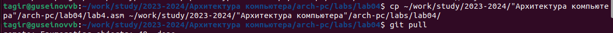

**Отчёт по лабораторной работе№4**

**Создание и процесс обработки программ на языке ассемблера NASM**

Гусейнов Тагир Гамзатович

**1	Цель работы**

Освоение процедуры компиляции и сборки программ, написанных на ассемблере NASM.

**2	Задание**

Здесь приводится описание задания в соответствии с рекомендациями методического пособия и выданным вариантом.

**3	Выполнение лабораторной работы**

- Создайте каталог для работы с программами на языке ассемблера NASM:

*Рис. 1: Создание каталога*

- Перейдём в созданный каталог:

*Рис. 2: Переход в каталог*

- Создадим текстовый файл с именем hello.asm:

*Рис. 3: Создание текстового файла*

Откроем этот файл с помощью текстового редактора

*Рис. 4: Открытие файла*

- Введём в него текст:

*Рис. 5: Ввод текста*

Скомпилируем данный текст

*Рис. 6: Компиляция текста*

- Проверим, что объектный файл был создан:

*Рис. 7: проверка, что объектный файл был создан*

Скомпилируем исходный файл hello.asm в obj.o и создадим файл листинга list.lst

*Рис. 8: Создание файлов*

- Проверим, что файлы были созданы.

*Рис. 9: Проверка, что файлы были созданы.*

- Передадим объектный файл на обработку компоновщику.

*Рис. 10: Передача файла на компоновку*

- Проверим, что исполняемый файл hello был создан.

*Рис. 11: Проверка, что исполняемый файл hello был создан*

- Зададим имя создаваемого исполняемого файла.

*Рис. 12: Зададим имя создаваемого исполняемого файла*

- Запустим на выполнение созданный исполняемый файл, находящийся в текущем каталоге.

*Рис. 13: Запуск на выполнение созданный исполняемый файл*

- Создадим копию файла hello.asm с именем lab4.asm

*Рис. 14: Создание копии файла с именем lab4.asm*

- Внесём изменения в текст программы в файле lab5.asm

*Рис. 15: Внесение изменения в текст программы*

- Оттранслируем полученный текст программы lab5.asm в объектный файл. Выполним компоновку объектного файла и запустим получившийся исполняемый файл.

*Рис. 16: Оттранслирование, компоновка, запуск*

- Скопируем файлы hello.asm и lab5.asm в локальный репозиторий и загрузим файлы на Github.

**4	Выводы**

В ходе выполнения работы, я освоила процедуры компиляции и сборки программ, написанных на ассемблере NASM.
