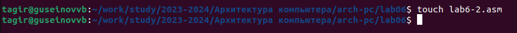
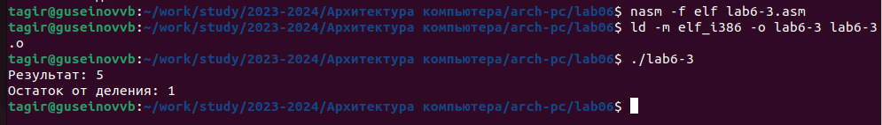

**Отчёта по лабораторной работе №6**

**Освоение арифметических инструкций языка ассемблера NASM.**

Гусейнов Тагир Гамзатович
# Содержание

# **1	Цель работы**
Целью работы является освоение арифметических инструкций языка ассемблера NASM.
# **2	Задание**
1. Написать программу вычисления выражения 𝑦 = 𝑓(𝑥). Вид функции 𝑓(𝑥) выбрать из таблицы 6.3 вариантов заданий в соответствии с номером полученным при выполнении лабораторной работы.
1. Загрузите файлы на GitHub.
# **3	Выполнение лабораторной работы**
1. Создайте каталог для программам лабораторной работы № 6, перейдите в него и создайте файл lab6-1.asm:
1. Рассмотрим примеры программ вывода символьных и численных значений. Программы будут выводить значения, записанные в регистр eax. (рис. 1, 2)

   Рис 1. создание лаб 6-1

Рис. 2 программа 1

*Рис. 3: Запуск  лаб 6-1

Никакой символ не виден, но он есть. Это возврат каретки LF.*

4. Как отмечалось выше,для работы с числами в файле in\_out.asm реализованы подпрограммы для преобразования ASCII символов в числа и обратно. Преобразуем текст программы из Листинга 7.1 с использованием этих функций. (рис. 5, 6)

   Рис 4 создание лаб 6 –2

*Рис. 5: программа лаь 6 –2* 

*Рис. 6: Работа программы*

В результате работы программы мы получим число 106. В данном случае, как и в первом, команда add складывает коды символов ‘6’ и ‘4’ (54+52=106). Однако, в отличии от программы из листинга 7.1, функция iprintLF позволяет вывести число, а не символ, кодом которого является это число.

5. Аналогично предыдущему примеру изменим символы на числа.

Создайте исполняемый файл и запустите его. Какой результат будет получен при исполнении программы? – получили число 10

*Рис. 7: Пример программы*

*Рис. 8: Работа программы*

Замените функцию iprintLF на iprint. Создайте исполняемый файл и запустите его. Чем отличается вывод функций iprintLF и iprint? - Вывод отличается что нет переноса строки. (рис. 9)

Рис 9 Измененная лаб 6 –2 (2)

*Рис. 10: Работа программы*

6. В качестве примера выполнения арифметических операций в NASM приведем программу вычисления арифметического выражения

fx=5\*2+3/3

Рис 11, создание лаб 6-3 

Рис. 12: программа лаб 6-3 

Рис. 13,  работа лаб 6-3

Измените текст программы для вычисления выражения

fx=4\*6+2/5

. Создайте исполняемый файл и проверьте его работу. 

Рис. 14.  программа лаб 6-3  в2

*Рис. 15: Работа программы*

7. В качестве другого примера рассмотрим программу вычисления варианта задания по номеру студенческого билета, работающую по следующему алгоритму:

Рис 16,  код Вариант

Рис. 17 Работа кода вариант.

Ответы на вопросы:

- 1. "mov eax, rem" и "call sprint" в секции кода отвечают за вывод сообщения "Ваш вариант:" на экран.
- 2. "mov ecx, x" и "mov edx, 80" загружают адрес буфера (x) и длину буфера (80) соответственно в регистры ecx и edx для вызова подпрограммы sread, которая считывает строку из консоли.
- 3. "call atoi" вызывает подпрограмму atoi для преобразования ASCII кодов символов в число, результат которого сохраняется в регистре eax.
- 4. Код для вычисления варианта начинается с "xor edx, edx" и "mov ebx, 20", после чего происходит деление числа, сохраненного в eax, на 20 с помощью инструкции "div ebx". Результат деления (цифра варианта) записывается в нижнюю часть регистра AX (AL). Затем происходит увеличение цифры варианта на единицу с помощью инструкции "inc edx".
- 5. Результат деления (цифра варианта) записывается в нижнюю часть регистра AX (AL).
- 6. Инструкция "inc edx" увеличивает цифру варианта на единицу для того, чтобы результат деления не оказывался равным нулю.
- 7. "mov eax, edx" загружает цифру варианта из AL (нижней части регистра AX) в регистр eax для вывода результата на экран с помощью подпрограммы iprintLF.
8. **Написать программу вычисления выражения y = f(x)**. Программа должна выводить выражение для вычисления, выводить запрос на ввод значения x, вычислять заданное выражение в зависимости от введенного x, выводить результат вычислений. Вид функции f(x) выбрать из таблицы 6.3 вариантов заданий в соответствии с номером полученным при выполнении лабораторной работы. Создайте исполняемый файл и проверьте его работу для значений x1 и x2 из 6.3. (рис. 16, рис. 17)

**Получили вариант 1** -

(10 + 2𝑥)/3

для х1= 1 и  x2= 10

Рис 18 Создание файла calc

*Рис. 19 Код программы calc* 

Рис. 20: Работа программы для  (10 + 2𝑥)/3

как видим все работает исправно программа решает пример длявссех представленных значений Х.

потом был гит пул но скрина нет.
# **4	Выводы**
В ходе выполнения работы, я освоил работу с арифметическими операциями на языке assebly.
